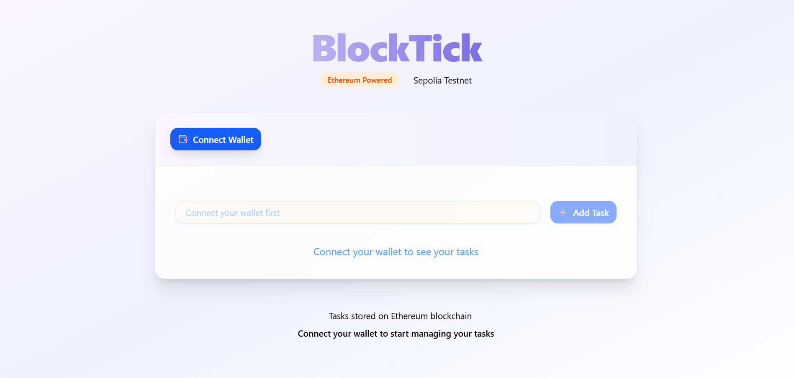

# BlockTick

A beautifully designed, Ethereum-powered, Web3 To-Do application built with Next.js, React, and Tailwind CSS.  
**Manage your tasks on-chain with wallet authentication, real-time feedback, and a modern, responsive interface.**

---

## 🚀 Features

- **Web3 Wallet Integration:** Connect/disconnect with MetaMask or other Ethereum wallets.
- **Network Awareness:** Supports Sepolia Testnet and displays real-time network status.
- **On-chain Task Management:** Add, complete, and view tasks stored on the Ethereum blockchain.
- **Loading & Transaction Feedback:** Toast notifications, spinners, and pending transaction indicators.
- **Modern UI/UX:** Glassmorphism, animated icons, micro-interactions, and mobile-first responsive design.
- **Accessibility:** ARIA attributes, keyboard navigation, and high-contrast color palette.
  

---

## 📸 Screenshots

 
 

---

## 🛠️ Tech Stack

- **Next.js** (App Router)
- **React**
- **Tailwind CSS**
- **Lucide React** (icons)
- **Ethers.js** (Web3 interactions)
- **shadcn/ui** (UI primitives)
- **React Toastify** (toasts/notifications)
- **TypeScript**

---
